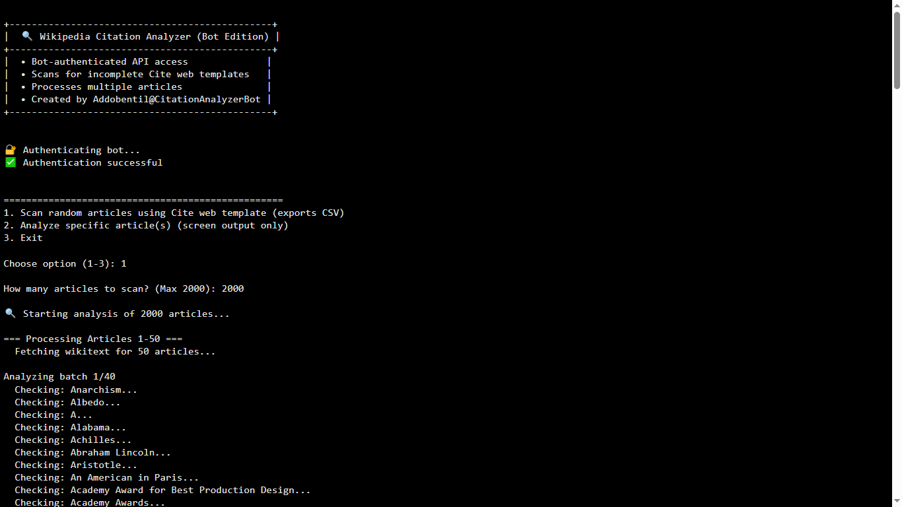
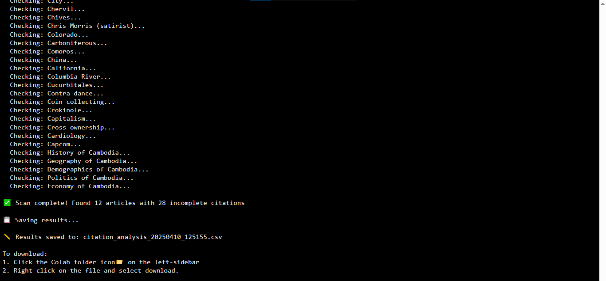
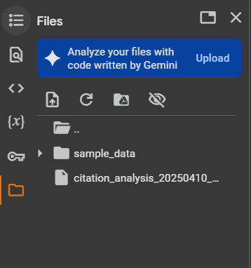
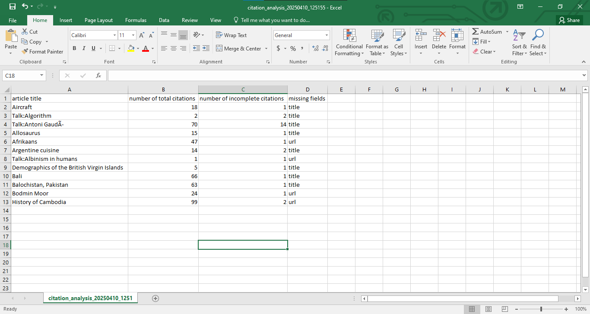
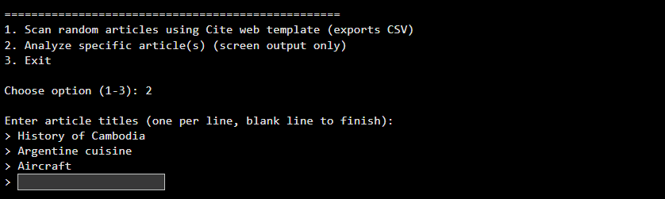
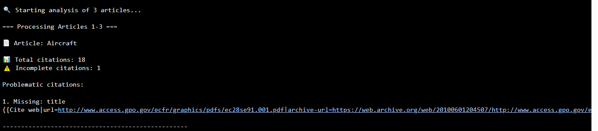
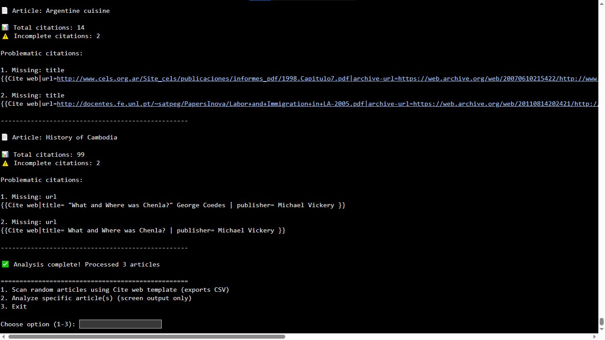
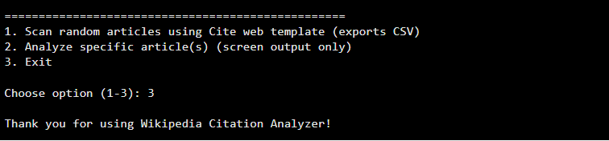

# Wikipedia Citation Analyzer (Bot Edition)

  
  


## Overview

The **Wikipedia Citation Analyzer (Bot Edition)** is a Python-based tool designed to scan Wikipedia articles for incomplete `{{Cite web}}` templates. It identifies citations missing required fields (`title` and `url`) and provides detailed reports, either as a CSV file for large-scale scans or as on-screen output for specific articles. The tool uses bot-authenticated API access to the MediaWiki API, ensuring higher rate limits and compliance with Wikipedia’s bot policy.

This project is optimized to run in Google Colab, making it accessible to users without local setup.

## Features

- **Bot-Authenticated API Access**: Uses a bot account for higher rate limits and efficient API requests.
- **Large-Scale Scanning**: Scans up to 2000 articles for incomplete `{{Cite web}}` templates and exports results to a CSV file.
- **Specific Article Analysis**: Analyze user-specified articles with detailed on-screen output.
- **Error Handling**: Robust handling of API rate limits, retries, and errors.
- **User-Friendly Interface**: Interactive menu with clear instructions and progress updates.
- **CSV Export**: Saves results in a structured CSV format for further analysis.

## Prerequisites

To use this tool, you’ll need:

- A **Google Colab** account (free tier is sufficient).
- A **Wikipedia bot account** with a bot username and password (see [Wikipedia Bot Policy](https://en.wikipedia.org/wiki/Wikipedia:Bot_policy)).
- Basic familiarity with Google Colab and Python.

## Setup Instructions

### 1. Clone the Repository

```bash
git clone https://github.com/addobentil/wikipedia-citation-analyzer.git
cd wikipedia-citation-analyzer
```

### 2. Open in Google Colab

[](https://colab.research.google.com/github/addobentil/wikipedia-citation-analyzer/blob/main/Wikipedia_Citation_Analyzer.ipynb)

Or upload the notebook manually into Colab.

### 3. Set Up Bot Credentials

1. Go to the **Secrets** tab (lock icon) in Colab.
2. Add the following secrets:
   - `WIKI_BOT_USERNAME`: Your bot username
   - `WIKI_BOT_PASSWORD`: Your bot password
3. Ensure secrets are saved and accessible to the notebook.

> ⚠️ **Do not hardcode your credentials.** Use Colab's Secrets feature for security.

## Usage Guide

### Running the Script

1. Open the notebook in Colab.
2. Add bot credentials as secrets.
3. Run all cells (`Runtime > Run all` or `Ctrl+F9`).

### Main Menu

```
+-----------------------------------------------+
|  🔍 Wikipedia Citation Analyzer (CLI Version) |
+-----------------------------------------------+
|  • Bot-authenticated API access              |
|  • Scans for incomplete Cite web templates   |
|  • Processes multiple articles               |
|  • CSV export capability                     |
+-----------------------------------------------+

==================================================
1. Scan random articles using Cite web template (exports CSV)
2. Analyze specific article(s) (screen output only)
3. Exit

Choose option (1-3):
```

---

### Option 1: Scan Random Articles

- Scans up to 2000 articles and saves a CSV file of incomplete citations.

**Output CSV includes**:

- `article title`
- `number of total citations`
- `number of incomplete citations`
- `missing fields`

**Screenshots**:  
  
  
  


---

### Option 2: Analyze Specific Articles

- Enter article titles one per line.
- See on-screen output of missing fields.

**Example Output**:

```
📄 Article: Python (programming language)
📊 Total citations: 45
⚠️ Incomplete citations: 3

1. Missing: url
{{Cite web|title=Official Python Documentation}}
```

**Screenshot**:  




---

### Option 3: Exit

- Exits the script with a farewell message.

**Screenshot**:  


---

## Example Usage

### Scan Random Articles

```
Choose option (1-3): 1
How many articles to scan? (Max 2000): 100
🔍 Starting analysis of 100 articles...
✅ Scan complete! Found 15 articles with 23 incomplete citations
📏 Results saved to: citation_analysis_20250409_123456.csv
```

### Analyze Specific Articles

```
Choose option (1-3): 2
> Python (programming language)
> Artificial intelligence

✅ Analysis complete! Processed 2 articles
```

---

## Project Structure

```
Wikipedia_Citation_Analyzer.ipynb   # Main notebook
modules/                            # CLI Version
README.md                           # Project documentation
screenshots/                        # Images for GitHub display
```

## Dependencies

Pre-installed in Colab:

- `requests`
- `re`
- `csv`
- `time`
- `datetime`
- `urllib.parse`
- `google.colab.files`
- `google.colab.userdata`
- `typing`

## Configuration

Inside the `Config` class:

- `API_URL`: `https://en.wikipedia.org/w/api.php`
- `USER_AGENT`: Custom identifier for Wikipedia bot
- `BOT_USERNAME`, `BOT_PASSWORD`: Fetched from secrets
- `REQUEST_DELAY`: 0.3 seconds
- `MAX_ARTICLES`: 2000
- `BATCH_SIZE`: 50

## Troubleshooting

### ❌ Bot Authentication Fails

- Check Colab secrets spelling and values.
- Ensure the bot account is approved.

### ⏳ Rate Limit Errors

- Automatically handled by the script.
- You can increase `REQUEST_DELAY` in `Config`.

### ⚠️ No Results Found

- Try scanning more articles or analyze specific ones.

### 📁 Download Issues in Colab

- Use the file explorer sidebar in Colab to manually download.

### ⚠️ Limitations

Note: This script does not parse Special pages, such as Talk pages or other non-mainspace articles. It only analyzes articles in the main namespace of Wikipedia.

## License

MIT License. See [LICENSE](LICENSE) for full text.

## Contact

- **Author**: Addobentil
- **Email**: addobentil100@gmail.com
- **GitHub**: [addobentil](https://github.com/addobentil)

## Acknowledgments

- Thanks to the Wikipedia community for the MediaWiki API.
- Built with ❤️ using Python and Google Colab.

---
